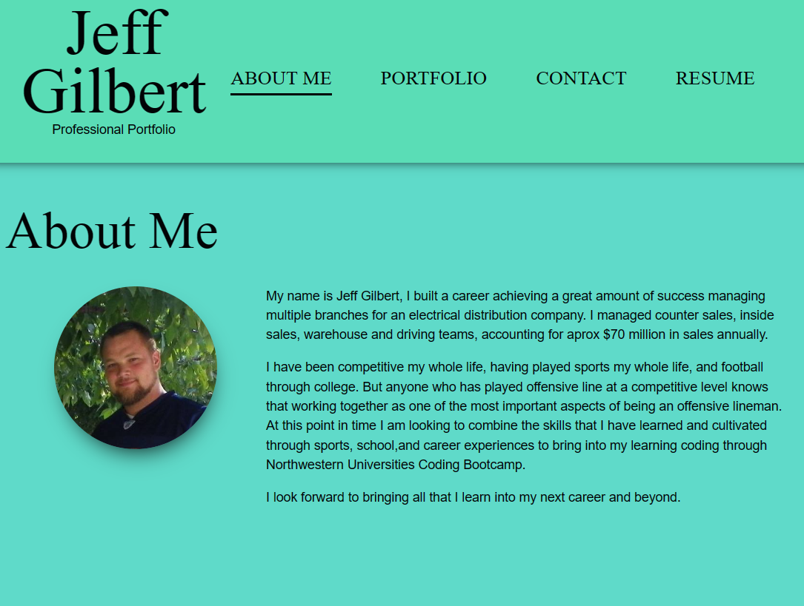
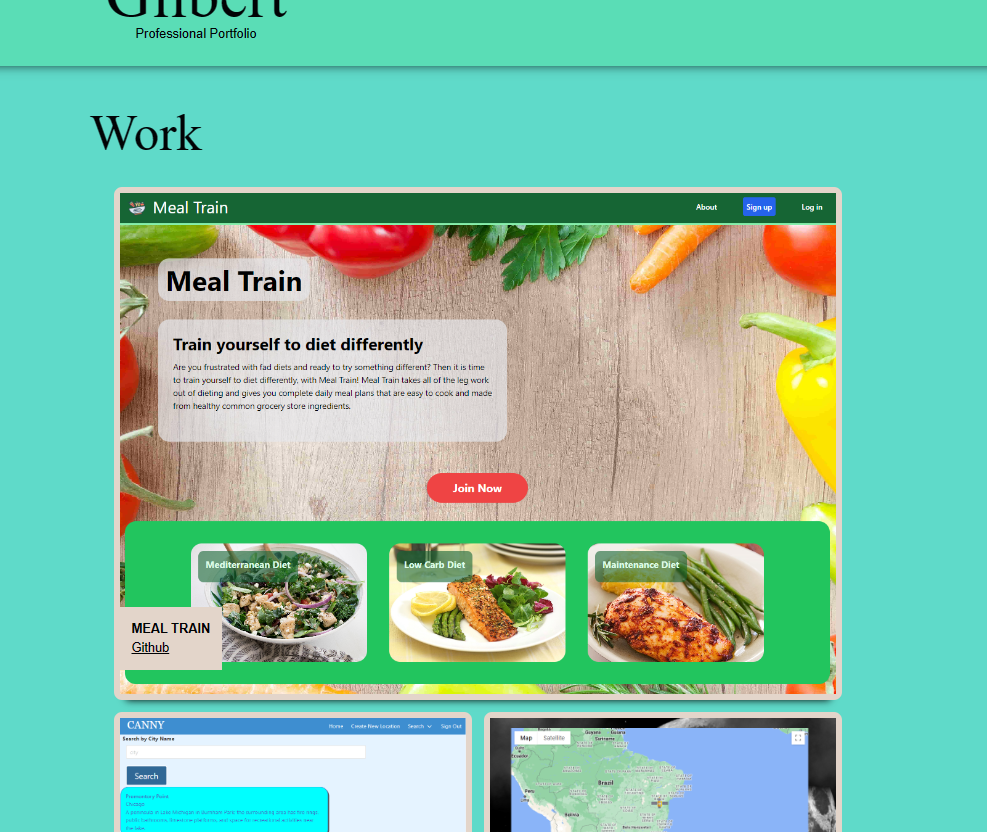
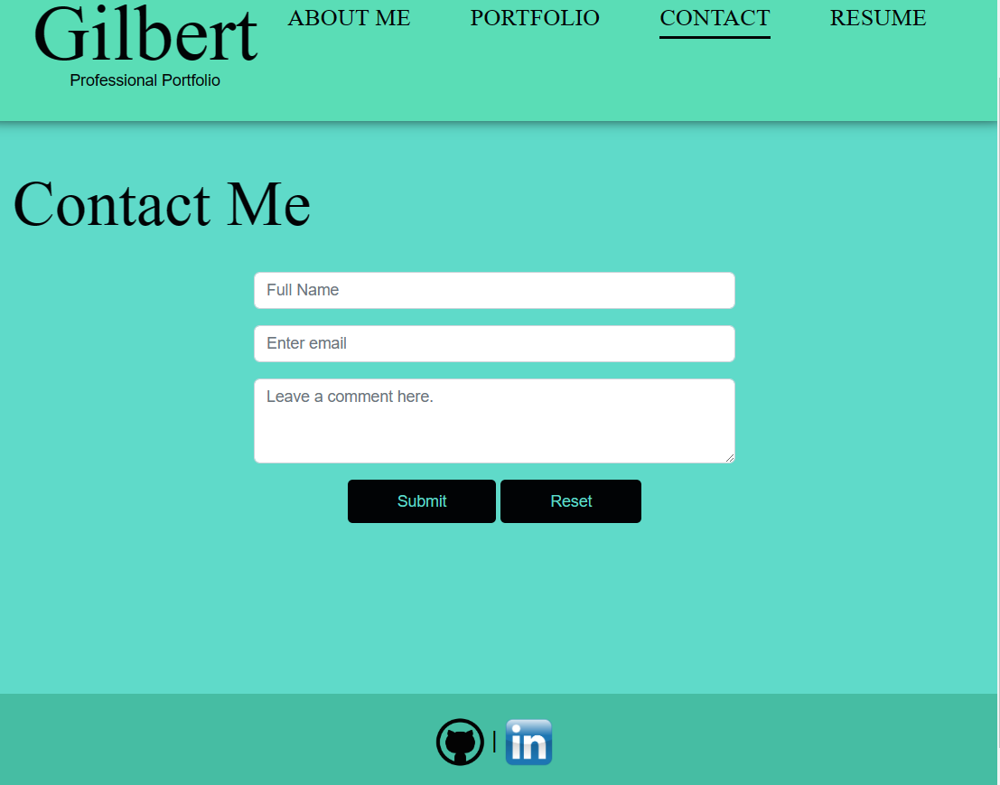
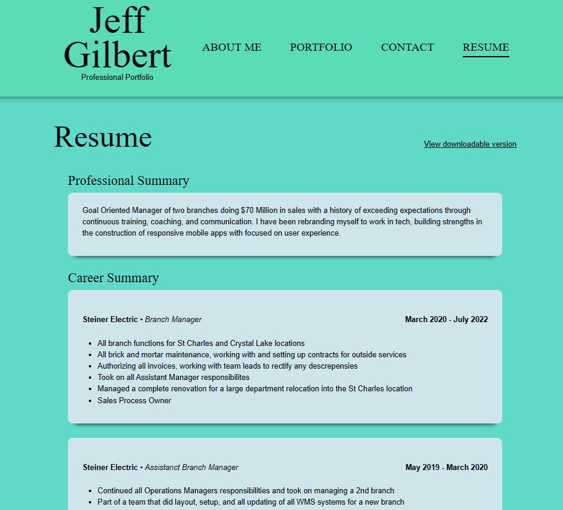

  # React Portfolio
  
  [](https://opensource.org/licenses/MIT)
  

  ## Description
  
 This is my professional online portfolio built using REACT. It links to other classwork my resume as well as an about me section.
 
  ## Table of Contents
  - [Screenshots](#screenshots)
  - [Links](#links)
  - [Questions](#questions)
  

 


  ## Screenshots

  ```About```

  

  ```My Work```

  

  ```Contact Form```

  

  ```Resume```

  
  

  ## Links

  Deployed Application: 
  https://jcgilbert70.github.io/REACT-Pro-Portfolio/

  Repository: 
  https://github.com/jcgilbert70/REACT-Pro-Portfolio.git


  ## Questions
  Any questions about this project please contact the creator jcgilbert70 at:
  jcgilbert70@gmail.com
  

  Check out other repositories by this creator at: https://github.com/jcgilbert70
  

  ## License: MIT
  
 
  MIT License Link: https://opensource.org/licenses/MIT

  
